# Codecademy Challenge Project: Company Home Page with Flexbox

This is a solution to the [Codecademy Challenge Project: Company Home Page with Flexbox](https://www.codecademy.com/paths/front-end-engineer-career-path/tracks/fecp-22-making-a-website-responsive/modules/wdcp-22-company-home-page/projects/company-page-with-flexbox).  

---
## Table of contents

- [Codecademy Challenge Project: Company Home Page with Flexbox](#codecademy-challenge-project-company-home-page-with-flexbox)
  - [Table of contents](#table-of-contents)
  - [Overview](#overview)
    - [The challenge](#the-challenge)
    - [Screenshot](#screenshot)
      - [Mobile View](#mobile-view)
      - [Tablet View](#tablet-view)
      - [Desktop View](#desktop-view)
    - [Links](#links)
  - [My process](#my-process)
    - [Built with](#built-with)
    - [What I learned](#what-i-learned)
    - [Useful resources](#useful-resources)
  - [Author](#author)

---
## Overview

### The challenge

- Build out the project to the project requirements provided
- Company homepage should include: 
  - title & logo 
  - mission statement 
  - list or set of images & titles representing product or products of the company 
  - company employee section
- Responsive to mobile view, tablet view and desktop view

---
### Screenshot

#### Mobile View
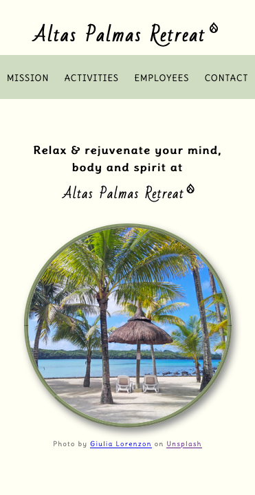
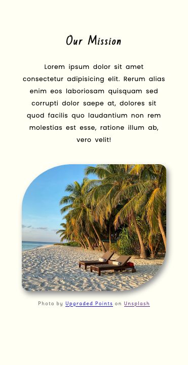
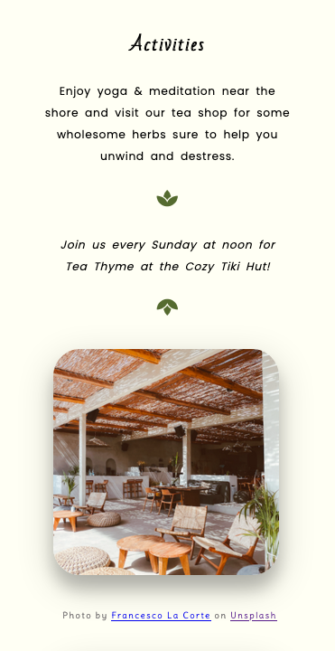
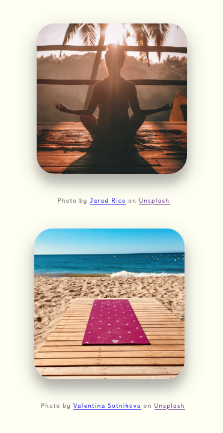
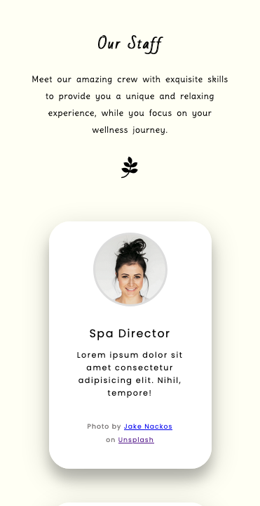
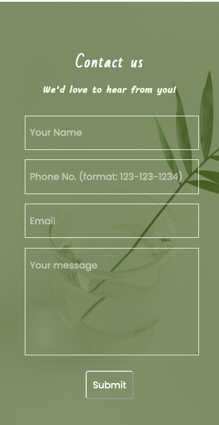

---

#### Tablet View
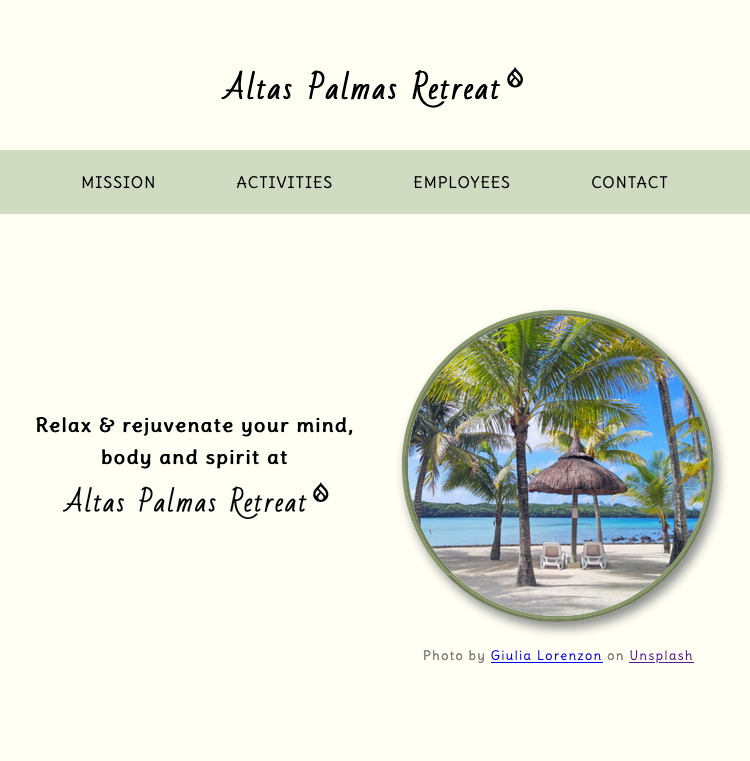
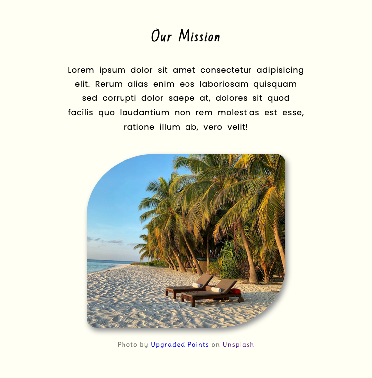
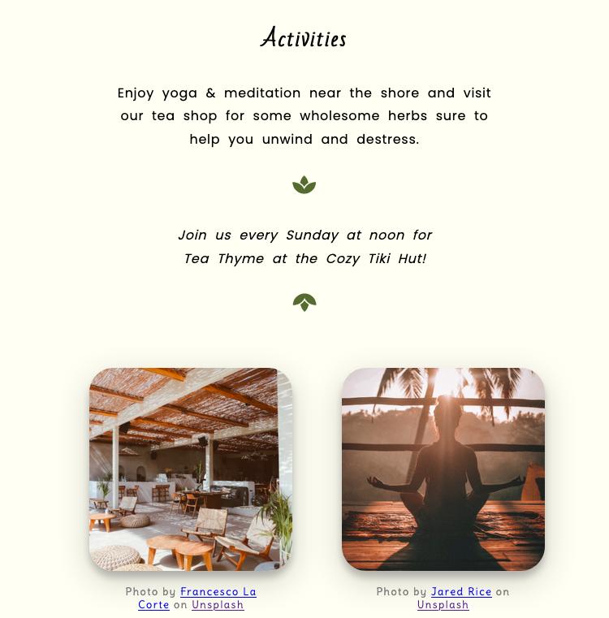
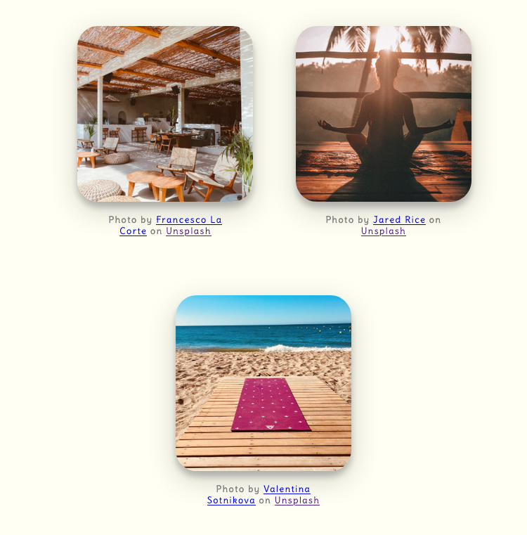
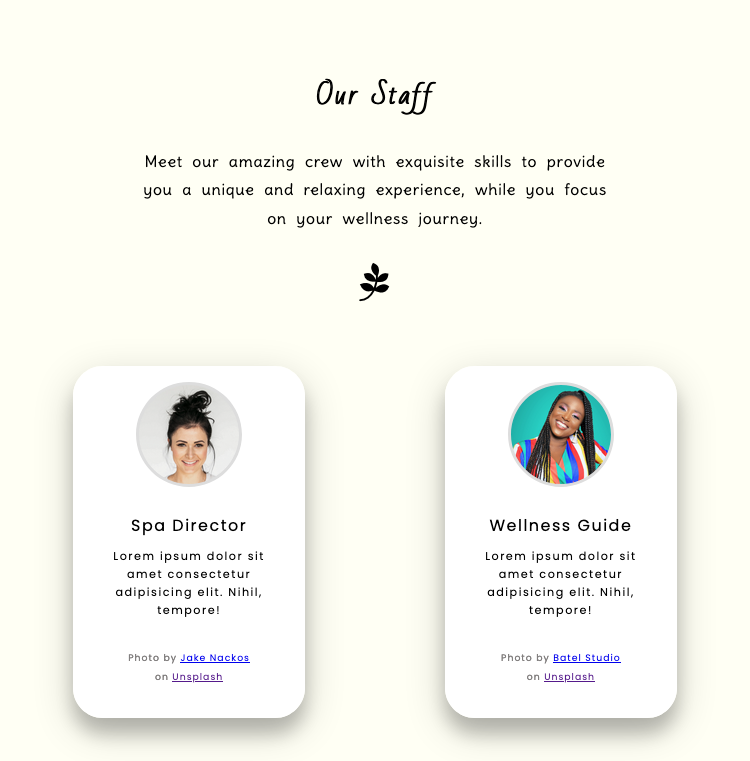
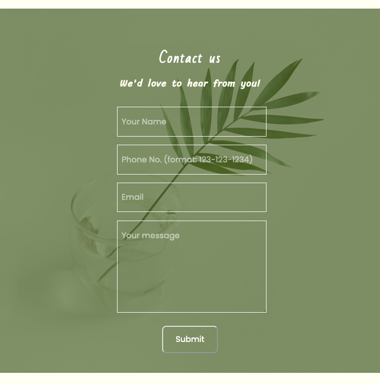

---

#### Desktop View
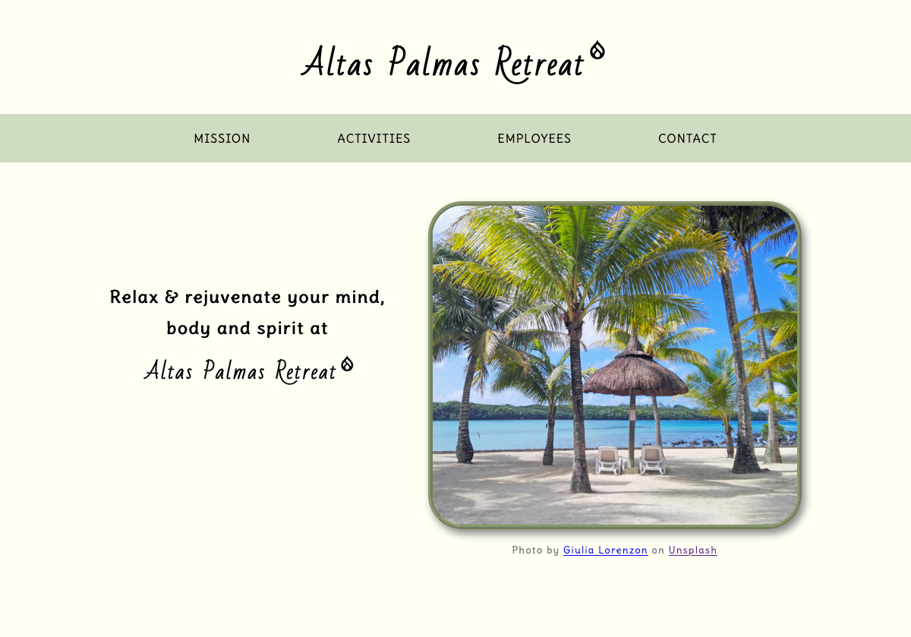
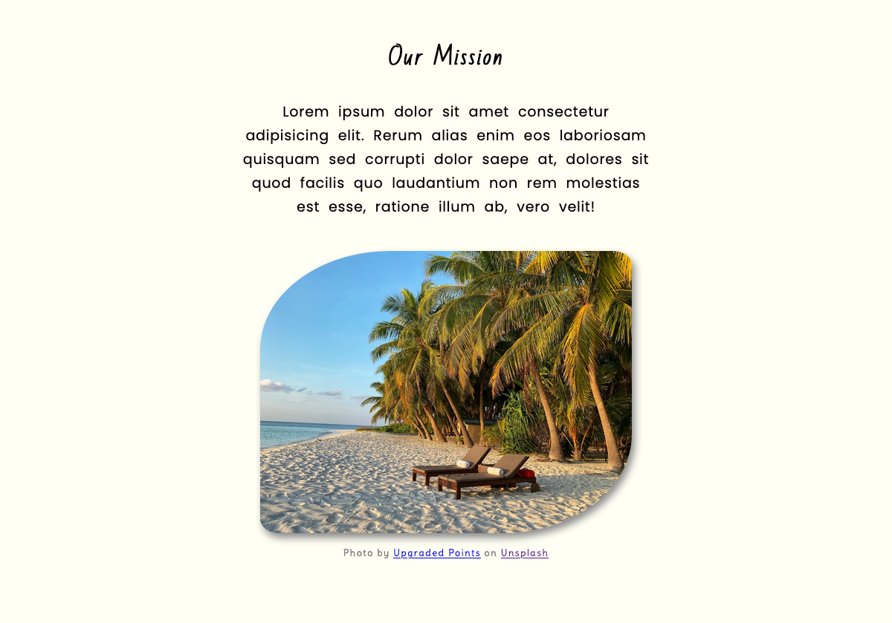
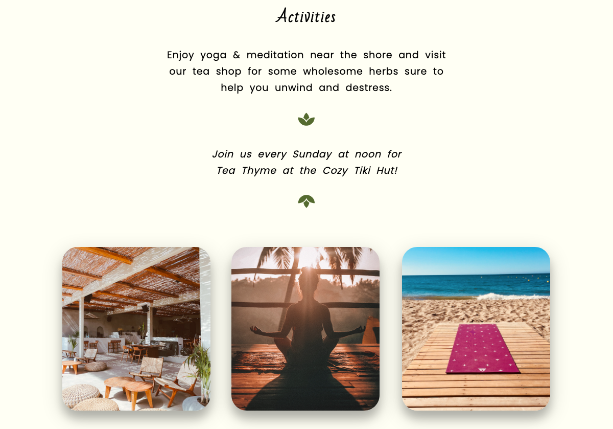
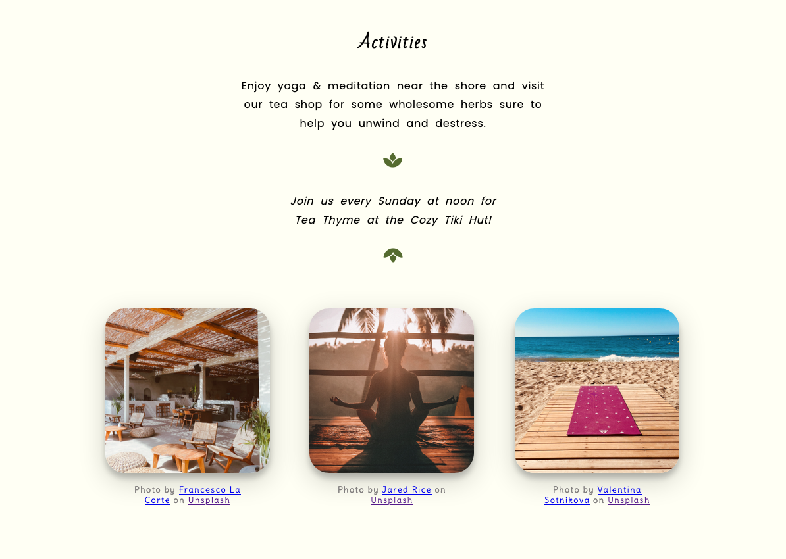
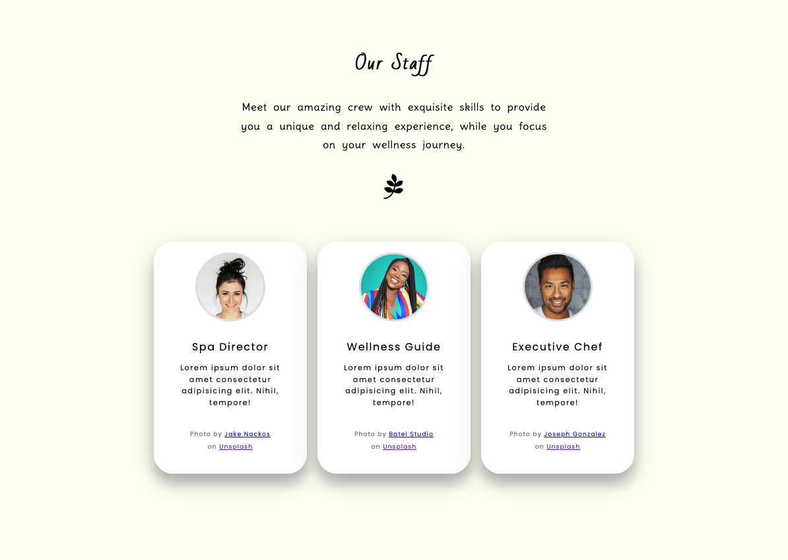
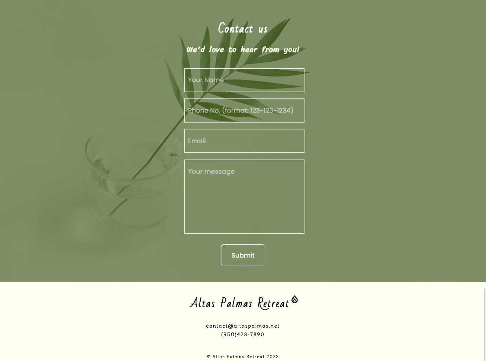

---

### Links

- Solution URL: [Github Code](https://github.com/VLOrozco/Mobile-first-responsive-profile-card-component.git)
- Live Site URL: [Altas Palmas Retreat | Company Home Page with Flexbox](https://vlorozco.github.io/Mobile-first-responsive-profile-card-component/)

---
## My process

### Built with

- HTML5
- CSS
- Flexbox
- Mobile-first workflow

### What I learned

I learned to create a webpage starting mobile-first view, how to utilize flexbox properties, and how to use media queries!

I struggled for a while with flexbox and getting media queries to work before this project. I researched many sources and began working on projects through Frontendmentor.io to get more acquainted with working on these concepts. I am happy with the progress and all I learned through these projects!

---
### Useful resources

[CSS-TRICKS | Chris Coyier - A Complete Guide to Flexbox](https://css-tricks.com/snippets/css/a-guide-to-flexbox/) - This guide to CSS flexbox layout helped me understand flexbox properties and relations with the parent (container) and child (items) elements.

[YouTube | Coder Coder - How to write media queries in CSS](https://www.youtube.com/watch?v=IsC5-C_nuF4) - This video helped me with understanding how to work with viewport setting with min-width and max-width in media queries.

[W3schools - CSS @media Rule](https://www.w3schools.com/cssref/css3_pr_mediaquery.asp) - Another resource for understanding media queries was through W3schools.

---

## Author

- Github - [Veronica L. Orozco](https://github.com/VLOrozco)
- Codecademy - [orozcov3](https://www.codecademy.com/profiles/orozcoV3)
- Frontend Mentor - [@VLOrozco](https://www.frontendmentor.io/profile/VLOrozco)
